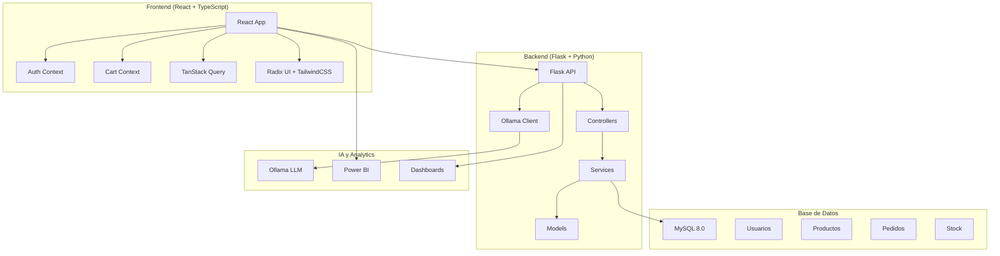

# 🏆 Marketplace Tarragona - Ganador Hackathon TechTalent

[](https://opensource.org/licenses/MIT)
[](https://reactjs.org/)
[](https://flask.palletsprojects.com/)
[](https://www.typescriptlang.org/)
[](https://www.mysql.com/)
[](https://tailwindcss.com/)

> **🎉 Proyecto ganador del Hackathon de Tarragona - TechTalent 2024**  
> Una plataforma innovadora que conecta productores locales con consumidores a través de IA y tecnologías modernas.

---

## 📋 Tabla de Contenidos

- [🎯 Acerca del Proyecto](#-acerca-del-proyecto)
- [🏆 Hackathon TechTalent](#-hackathon-techtalent)
- [✨ Características Principales](#-características-principales)
- [🛠️ Tecnologías Utilizadas](#️-tecnologías-utilizadas)
- [🏗️ Arquitectura del Sistema](#️-arquitectura-del-sistema)
- [🚀 Instalación y Configuración](#-instalación-y-configuración)
- [📱 Funcionalidades](#-funcionalidades)
- [🤖 Chatbot con IA](#-chatbot-con-ia)
- [📊 Analytics y Dashboards](#-analytics-y-dashboards)
- [🎬 Demo y Capturas de Pantalla](#-demo-y-capturas-de-pantalla)
- [👥 Equipo](#-equipo)
- [🔮 Futuras Mejoras](#-futuras-mejoras)
- [📄 Licencia](#-licencia)

---

## 🎯 Acerca del Proyecto

**Marketplace Tarragona** es una plataforma de comercio electrónico innovadora diseñada para **conectar productores locales de Tarragona con consumidores** de manera eficiente y moderna. La aplicación combina un marketplace tradicional con características avanzadas como **inteligencia artificial**, **analytics en tiempo real** y **gestión completa de inventario**.

### 🌟 Propuesta de Valor

- **🌱 Fomenta la economía local** conectando directamente productores y consumidores
- **🤖 IA integrada** para una experiencia de usuario superior
- **📊 Analytics avanzado** para toma de decisiones basada en datos
- **📱 Experiencia móvil optimizada** para el comercio moderno
- **🔧 Gestión completa** tanto para vendedores como compradores

---

## 🏆 Hackathon TechTalent

Este proyecto fue desarrollado durante el **Hackathon de Tarragona organizado por TechTalent**, donde nuestro equipo logró el **primer lugar** 🥇.

### 🎯 Reto del Hackathon
Crear una solución tecnológica innovadora que impulse la digitalización y el crecimiento del ecosistema empresarial local de Tarragona.

### 🏅 Por qué Ganamos
- **Innovación técnica**: Integración de IA local con Ollama
- **Impacto social**: Solución real para productores locales
- **Calidad técnica**: Arquitectura robusta y escalable
- **Experiencia de usuario**: Interfaz moderna y intuitiva
- **Completitud**: Funcionalidades end-to-end implementadas

### 🎥 Ver el Proyecto en Acción
¡No te pierdas nuestras **demostraciones en video**! Incluimos dos GIFs que muestran:
1. **🔧 Instalación y configuración** del proyecto completo
2. **🚀 Uso completo de la aplicación** con todas sus características

---

## ✨ Características Principales

### 🛒 **Para Clientes**
- ✅ Navegación intuitiva por categorías de productos
- ✅ Carrito de compras persistente
- ✅ Sistema completo de pedidos
- ✅ Filtrado avanzado (categoría, origen, alérgenos)
- ✅ Perfil personalizable
- ✅ Historial de compras

### 🏪 **Para Vendedores**
- ✅ Panel de administración completo
- ✅ Gestión de productos e inventario
- ✅ Control de stock con alertas
- ✅ Seguimiento de pedidos en tiempo real
- ✅ Analytics y estadísticas de ventas

### 🤖 **Inteligencia Artificial**
- ✅ Chatbot con procesamiento de lenguaje natural
- ✅ Búsqueda inteligente de productos
- ✅ Respuestas contextuales en tiempo real
- ✅ Detección automática de intenciones
- ✅ Integración con base de datos en vivo

### 📊 **Analytics y Reportes**
- ✅ Dashboard administrativo con métricas
- ✅ Integración con Power BI
- ✅ Gráficos interactivos
- ✅ Estadísticas en tiempo real

---

## 🛠️ Tecnologías Utilizadas

### **Frontend**
| Tecnología | Versión | Propósito |
|-----------|---------|-----------|
|  | 18.3.1 | Framework principal |
|  | 5.5.3 | Tipado estático |
|  | 5.4.1 | Build tool |
|  | 3.4.11 | Estilos |
|  | Latest | Componentes |

### **Backend**
| Tecnología | Versión | Propósito |
|-----------|---------|-----------|
|  | 3.13 | Lenguaje principal |
|  | Latest | Framework web |
|  | 8.0 | Base de datos |
|  | Latest | LLM local |

### **Herramientas Adicionales**
- **🔐 Autenticación**: Flask-BCrypt
- **📊 Validación**: Marshmallow
- **📋 Documentación**: Swagger UI
- **🎨 Gráficos**: Recharts
- **🔄 Estado**: TanStack Query + React Context

---

## 🏗️ Arquitectura del Sistema



### **Flujo de Datos**
1. **Frontend** → Requests HTTP → **API Flask**
2. **Controllers** → Validación → **Services**
3. **Services** → Consultas → **MySQL Database**
4. **Chatbot** → Ollama LLM → **Respuestas IA**
5. **Analytics** → Power BI → **Visualizaciones**

---

## 🚀 Instalación y Configuración

### **🎬 Demo de Instalación**

*Demostración de cómo iniciar el backend y frontend del proyecto*

### **Prerrequisitos**
- Python 3.13+
- Node.js 18+
- MySQL 8.0+
- Ollama instalado localmente

### **1. Clonar el Repositorio**
```bash
git clone https://github.com/tu-usuario/marketplace-tarragona.git
cd marketplace-tarragona
```

### **2. Configurar Backend**
```bash
cd Backend
pip install -r requirements.txt

# Configurar variables de entorno
cp .env.example .env
# Editar .env con tus credenciales de MySQL

# Crear base de datos
mysql -u root -p < "Base de datos v1.sql"

# Ejecutar servidor
python run.py
```

### **3. Configurar Frontend**
```bash
cd Frontend
npm install

# Ejecutar en desarrollo
npm run dev
```

### **4. Configurar Ollama (Chatbot)**
```bash
# Instalar Ollama desde https://ollama.ai
ollama pull llama2

# Verificar que funciona
curl http://localhost:11434/api/tags
```

### **5. Acceder a la Aplicación**
- **Frontend**: http://localhost:5173
- **Backend API**: http://localhost:5000
- **Swagger Docs**: http://localhost:5000/docs

---

## 📱 Funcionalidades

### **🏠 Página Principal**
- Grid de categorías con imágenes
- Productos destacados
- Búsqueda rápida
- Chatbot flotante

### **🛍️ Catálogo de Productos**
- Filtros por categoría, origen, alérgenos
- Cards con información detallada
- Añadir al carrito directamente
- Vista de stock en tiempo real

### **🛒 Carrito de Compras**
- Persistencia en localStorage
- Actualización de cantidades
- Cálculo automático de totales
- Proceso de checkout completo

### **👤 Gestión de Usuarios**
- Registro con validación completa
- Login seguro con BCrypt
- Perfil editable
- Roles diferenciados (cliente/vendedor)

### **📊 Panel de Administración**
- Dashboard con métricas clave
- Gestión de productos
- Control de usuarios
- Estadísticas de ventas
- Integración con Power BI

---

## 🤖 Chatbot con IA

### **Capacidades del Chatbot**
- **🧠 Procesamiento de lenguaje natural** con Ollama
- **🎯 Detección automática de intenciones**
- **💬 Respuestas contextuales** basadas en datos reales
- **⚡ Optimizado para respuestas < 1 minuto**

### **Tipos de Consultas Soportadas**

#### **Productos**
```
"¿Qué productos de fruta tienes disponibles?"
"¿Hay productos sin alérgenos?"
"Muéstrame productos de Tarragona"
"¿Tienes manzanas en stock?"
```

#### **Pedidos**
```
"¿Cuántos pedidos hay pendientes?"
"Hazme un pedido de 2kg de manzanas"
"¿Qué pedidos están enviados?"
```

#### **Estadísticas**
```
"¿Cuántos usuarios hay registrados?"
"¿Cuáles son los productos más populares?"
"Muéstrame las estadísticas del marketplace"
```

### **Endpoints del Chatbot**
- `POST /chatbot/query` - Consulta principal
- `GET /chatbot/search` - Búsqueda de productos
- `GET /chatbot/products/{tipo}` - Productos por categoría
- `GET /chatbot/stats` - Estadísticas del marketplace
- `POST /chatbot/create-order` - Crear pedidos

---

## 📊 Analytics y Dashboards

### **Métricas Principales**
- 📈 Total de usuarios registrados
- 🛍️ Productos disponibles por categoría
- 📦 Pedidos por estado
- 💰 Ventas por vendedor
- 📊 Productos con stock bajo

### **Integración Power BI**
- Modal dedicado para análisis avanzado
- Reportes interactivos
- Visualizaciones en tiempo real
- Export de datos para análisis

### **Dashboard Administrativo**
- Gráficos con Recharts
- Métricas en tiempo real
- Filtros avanzados
- Exportación de reportes

---

## 🎬 Demo y Capturas de Pantalla

### **🎥 Demostración Completa de la Aplicación**

*Demostración completa del uso de la aplicación con todas sus características: navegación, carrito, chatbot, panel administrativo y más*

### **🏠 Página Principal**
Una landing page moderna con categorías organizadas y acceso directo al chatbot.

### **🛍️ Catálogo de Productos**
Vista de productos con filtros avanzados y información detallada de cada artículo.

### **🤖 Chatbot Inteligente**
Interfaz conversacional que entiende preguntas en lenguaje natural.

### **📊 Panel Administrativo**
Dashboard completo con métricas, gráficos y gestión de inventario.

---

## 👥 Equipo

Proyecto desarrollado por el equipo ganador del Hackathon TechTalent Tarragona 2024:

- **[Nombre]** - Full Stack Developer
- **[Nombre]** - Frontend Specialist  
- **[Nombre]** - Backend & AI Engineer
- **[Nombre]** - UX/UI Designer
- **[Nombre]** - Data Analyst

---

## 🔮 Futuras Mejoras

### **🚀 Funcionalidades Planificadas**
- [ ] **App móvil nativa** (React Native)
- [ ] **Pagos integrados** (Stripe/PayPal)
- [ ] **Sistema de reseñas** y calificaciones
- [ ] **Notificaciones push** en tiempo real
- [ ] **Geolocalización** para delivery
- [ ] **Marketplace multiidioma** (catalán, inglés)

### **🤖 Mejoras de IA**
- [ ] **Recomendaciones personalizadas** con ML
- [ ] **Análisis de sentimientos** en reviews
- [ ] **Chatbot por voz** con speech-to-text
- [ ] **Predicción de demanda** para vendedores

### **📊 Analytics Avanzado**
- [ ] **Machine Learning** para insights
- [ ] **Dashboards personalizados** por usuario
- [ ] **Alertas automáticas** de negocio
- [ ] **Integración con Google Analytics**

---

## 🤝 Contribuir

1. Fork el proyecto
2. Crea una rama para tu feature (`git checkout -b feature/AmazingFeature`)
3. Commit tus cambios (`git commit -m 'Add some AmazingFeature'`)
4. Push a la rama (`git push origin feature/AmazingFeature`)
5. Abre un Pull Request

---

## 📞 Contacto

- **Email**: [tu-email@ejemplo.com]
- **LinkedIn**: [Tu LinkedIn]
- **GitHub**: [Tu GitHub]

---

## 📄 Licencia

Este proyecto está bajo la Licencia MIT. Ver el archivo `LICENSE` para más detalles.

---

## 🙏 Agradecimientos

- **TechTalent** por organizar el hackathon
- **Ayuntamiento de Tarragona** por el apoyo
- **Comunidad local** de productores
- **Mentores** del hackathon
- **Jurado** por reconocer nuestro trabajo

---

<div align="center">

**🏆 Proyecto Ganador - Hackathon TechTalent Tarragona 2024 🏆**

*Desarrollado con ❤️ para impulsar la economía local de Tarragona*

[](#-marketplace-tarragona---ganador-hackathon-techtalent)

</div> 